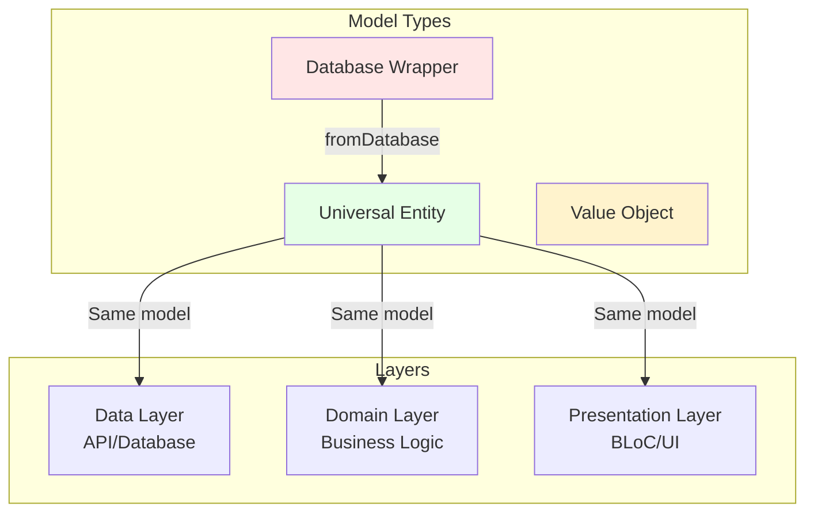

# Data Models Architecture

## Обзор

В проекте используются **plain Dart classes** (без freezed/json_serializable) для моделей данных.

**Принцип:** Одна модель используется на **всех слоях** (Data → Domain → Presentation) для простоты и избежания избыточных преобразований.

---

## 1. Типы моделей

### 1.1. Universal Entity (Универсальная сущность)

**Назначение:** Единая модель для API, Domain и Presentation слоёв.

**Характеристики:**

- Суффикс: `*Entity` или без суффикса
- Слой: `domain/models/` (используется везде)
- Сериализация: `fromJson()` / `toJson()` → `Map<String, Object?>`
- Иммутабельность: `@immutable`
- Методы: `copyWith()`, `==`, `hashCode`, `toString()`
- Опционально: `Comparable<T>` для сортировки
- **Используется:** Data Source → Repository → BLoC → UI

---

### 1.2. Database Wrapper (Обёртка для БД)

**Назначение:** Обёртка над моделью из базы данных для использования в других слоях.

**Когда использовать:**

- Модель из БД (Drift) содержит служебную информацию
- Нужно объединить несколько таблиц в одну сущность
- БД модель не подходит для Domain/Presentation

**Характеристики:**

- Суффикс: `*WithRelations` или `With*`
- Слой: `database/models/` (создается) → `domain/models/` (используется)
- Методы: `fromDatabase()` в Domain модели для преобразования
- Композиция: Содержит Drift модели + дополнительные данные

---

### 1.3. Value Object (Объект-значение)

**Назначение:** Неизменяемые данные без идентификатора (для передачи параметров).

**Характеристики:**

- Без суффикса или `*Data`
- Слой: Любой (`domain/models/`, `data/models/`)
- Все поля `final` + `const` конструктор
- Методы: `==`, `hashCode` (без `copyWith`, `toString`)
- Без сериализации (создается в коде)

---

### Выбор типа модели

| Сценарий                     | Тип модели                          | Пример                        |
| ---------------------------- | ----------------------------------- | ----------------------------- |
| API → Repository → BLoC → UI | Universal Entity                    | `UserEntity` везде            |
| База данных → Domain         | Database Wrapper → Universal Entity | `HistoryEntry.fromDatabase()` |
| Форма с валидацией → API     | Form Data → Universal Entity        | `RegistrationData.toEntity()` |
| Параметры функции/изолят     | Value Object                        | `AnalyzeImageData`            |

### Ключевые принципы

1. **Одна модель на всех слоях:** Universal Entity используется в Data → Domain → Presentation без преобразований
2. **Database Wrapper только для БД:** Преобразуется в Universal Entity через `fromDatabase()`
3. **Иммутабельность:** Все поля `final`, конструкторы `const` где возможно
4. **Type Safety:** `Object?` для `fromJson()`, явное приведение типов
5. **Отдельные классы для форм:** Form Data с валидацией, преобразуются в Universal Entity
6. **Без избыточных преобразований:** Нет DTO ↔ Entity на каждом слое
7. **Без кодогенерации:** Plain Dart classes для полного контроля
