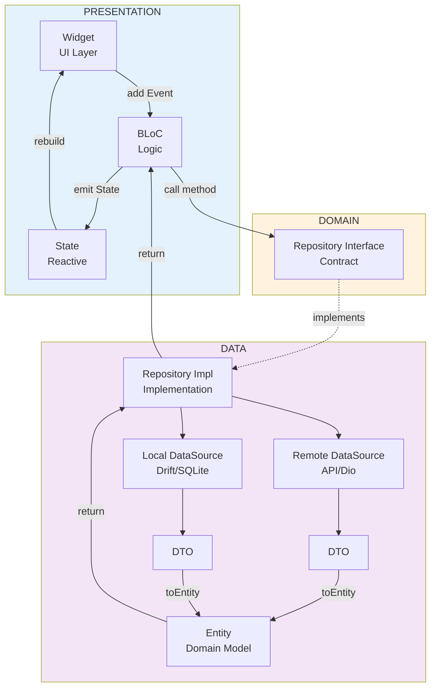
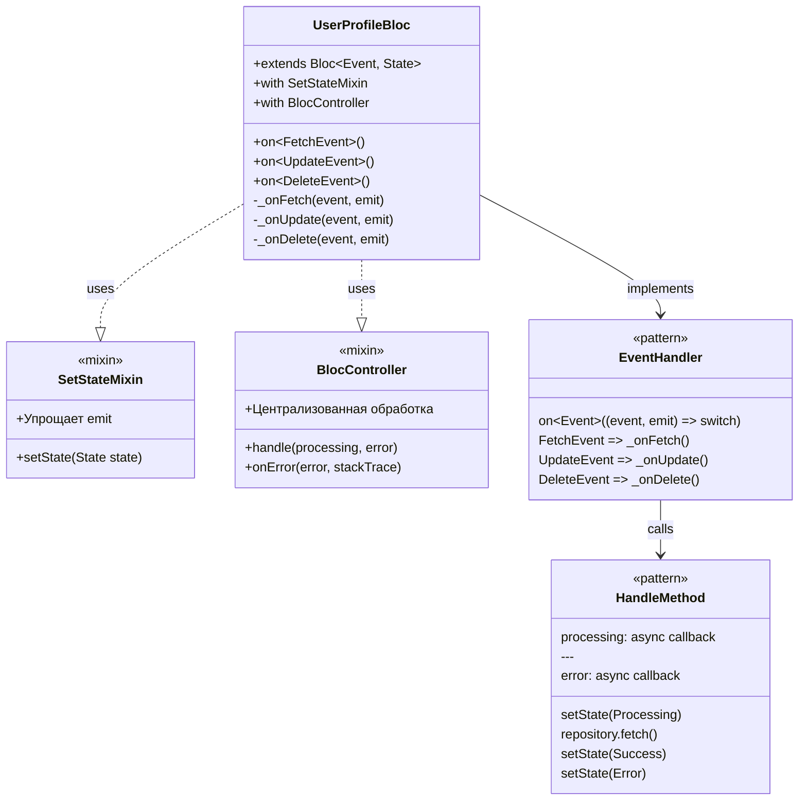
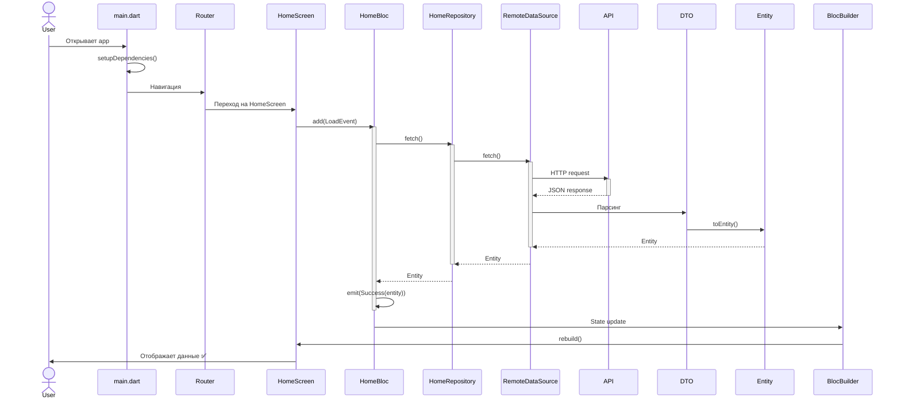

# 🗺️ Карта архитектуры Health Flutter

Визуальное представление архитектуры проекта.

## 📦 Структура Monorepo

```
health_flutter/
├── 📱 app/                          # Flutter приложение
│   ├── lib/
│   │   ├── main.dart
│   │   └── src/
│   │       ├── bloc/               # Глобальные BLoC, например AppBlocObserver
│   │       ├── logic/              # Startup логика
│   │       ├── model/              # Глобальные модели
│   │       ├── navigation/         # Роутинг
│   │       └── widget/             # Глобальные виджеты
│   ├── android/
│   └── ios/
│
├── 🔧 core/                         # Переиспользуемые модули
│   ├── analytics/                  # Firebase Analytics
│   ├── common/                     # Общие утилиты, extensions
│   ├── database/                   # Drift БД
│   ├── error_reporter/             # Sentry error reporting
│   ├── logger/                     # Логирование
│   ├── navigator_api/              # Интерфейсы навигации
│   ├── rest_client/                # HTTP клиент
│   ├── translations/               # i18n локализация
│   └── ui_library/                 # Переиспользуемые UI компоненты
│
└── 🎯 feature/                      # Feature модули
    ├── analytics_service_interface/
    ├── auth/                       # Авторизация
    ├── check_health/               # Проверка здоровья
    ├── gms/                        # Google Mobile Services
    ├── history_entries/            # История записей
    ├── home/                       # Главный экран
    ├── settings/                   # Настройки
    ├── tts/                        # Text-to-Speech
    └── user_profile/               # Профиль пользователя
```

## 🏗️ Clean Architecture (Feature модуль)

```
feature/user_profile/
└── lib/
    ├── user_profile.dart                    # 📤 Публичные экспорты
    └── src/
        │
        ├── 🎨 presentation/                 # UI слой
        │   ├── logic/
        │   │   └── bloc/
        │   │       └── user_profile_bloc.dart
        │   │           ├── UserProfileBloc       # BLoC
        │   │           ├── UserProfileEvent      # sealed class
        │   │           │   ├── _FetchEvent
        │   │           │   ├── _UpdateEvent
        │   │           │   └── _DeleteEvent
        │   │           └── UserProfileState      # sealed class
        │   │               ├── State$Idle
        │   │               ├── State$Processing
        │   │               ├── State$Success
        │   │               └── State$Error
        │   └── widget/
        │       ├── user_profile_screen.dart      # Экран с BlocProvider
        │       └── components/                   # UI компоненты
        │
        ├── 🧠 domain/                       # Бизнес-логика
        │   ├── models/
        │   │   └── user_profile_entity.dart      # Entity (доменная модель)
        │   └── repositories/
        │       └── user_profile_repository.dart  # Interface (контракт)
        │
        ├── 💾 data/                         # Источники данных
        │   ├── models/
        │   │   └── user_profile_dto.dart         # DTO (для API/БД)
        │   ├── datasources/
        │   │   ├── user_profile_remote_data_source.dart  # API
        │   │   └── user_profile_local_data_source.dart   # БД
        │   └── repositories/
        │       └── user_profile_repository_impl.dart     # Реализация
        │
        └── 🔌 dependencies/                 # Dependency Injection
            └── user_profile_dependencies.dart
```

## 🔄 Поток данных



## 🎭 BLoC Pattern с миксинами



##

## 🗂️ Файловая структура (пример)

```
feature/user_profile/
├── 📄 pubspec.yaml
├── 📁 lib/
│   ├── 📄 user_profile.dart                                    # Exports
│   └── 📁 src/
│       ├── 📁 presentation/
│       │   ├── 📁 logic/bloc/
│       │   │   └── 📄 user_profile_bloc.dart                  # 300 lines
│       │   └── 📁 widget/
│       │       ├── 📄 user_profile_screen.dart                # 50 lines
│       │       └── 📁 components/
│       │           ├── 📄 profile_header.dart                 # 80 lines
│       │           ├── 📄 profile_info.dart                   # 100 lines
│       │           └── 📄 profile_actions.dart                # 60 lines
│       ├── 📁 domain/
│       │   ├── 📁 models/
│       │   │   └── 📄 user_profile_entity.dart                # 100 lines
│       │   └── 📁 repositories/
│       │       └── 📄 user_profile_repository.dart            # 30 lines
│       ├── 📁 data/
│       │   ├── 📁 models/
│       │   │   └── 📄 user_profile_dto.dart                   # 80 lines
│       │   ├── 📁 datasources/
│       │   │   ├── 📄 user_profile_remote_data_source.dart    # 100 lines
│       │   │   └── 📄 user_profile_local_data_source.dart     # 80 lines
│       │   └── 📁 repositories/
│       │       └── 📄 user_profile_repository_impl.dart       # 120 lines
│       └── 📁 dependencies/
│           └── 📄 user_profile_dependencies.dart              # 50 lines
└── 📁 test/
    ├── 📁 bloc/
    │   └── 📄 user_profile_bloc_test.dart                     # 200 lines
    ├── 📁 repositories/
    │   └── 📄 user_profile_repository_test.dart               # 150 lines
    └── 📁 datasources/
        └── 📄 user_profile_remote_data_source_test.dart       # 100 lines
```

## 🎨 UI Component Hierarchy

```
ui_library/
└── src/
    ├── components/
    │   ├── buttons/
    │   │   ├── AppButton                   # Primary, Secondary, Outlined
    │   │   └── AppIconButton
    │   ├── inputs/
    │   │   ├── AppTextField
    │   │   ├── AppDropdown
    │   │   └── AppCheckbox
    │   ├── cards/
    │   │   ├── AppCard
    │   │   └── AppInfoCard
    │   ├── dialogs/
    │   │   ├── AppDialog
    │   │   ├── ConfirmationDialog
    │   │   └── LoadingDialog
    │   └── loaders/
    │       ├── AppLoader
    │       └── AppProgressBar
    ├── theme/
    │   ├── app_theme.dart
    │   ├── app_colors.dart
    │   ├── app_text_styles.dart
    │   └── app_dimensions.dart
    └── extensions/
        ├── context_extensions.dart
        ├── string_extensions.dart
        └── datetime_extensions.dart
```

## 📊 Типичный User Flow


