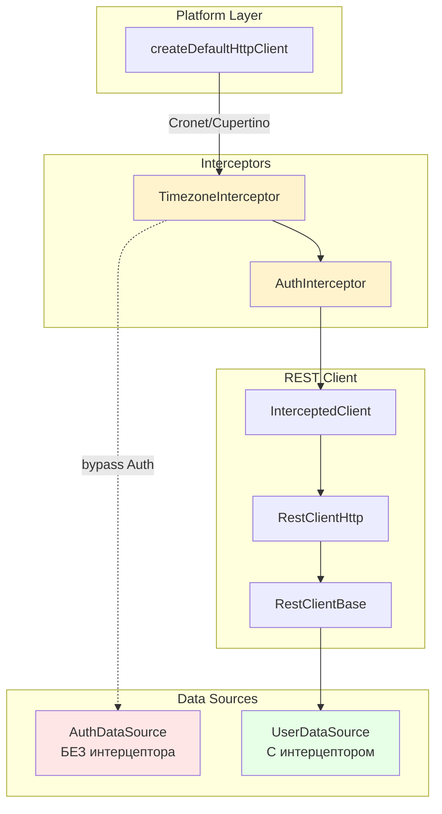
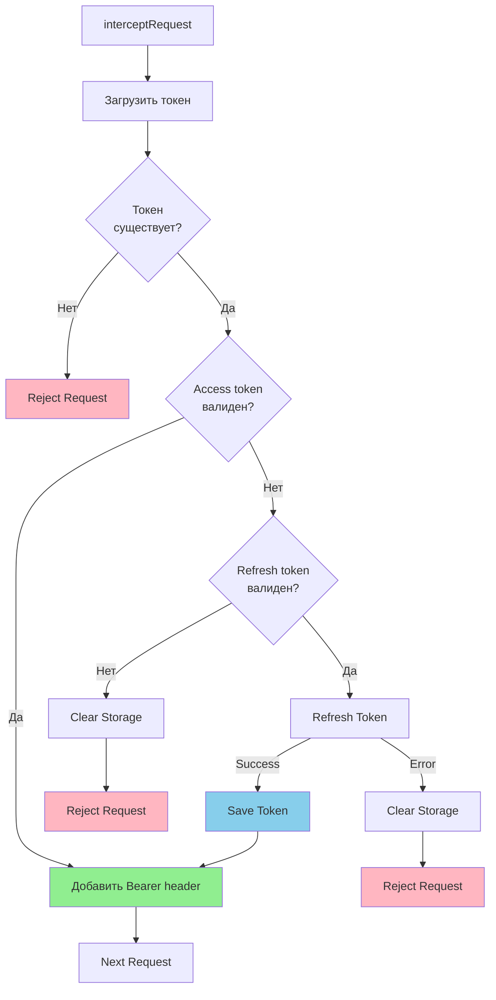
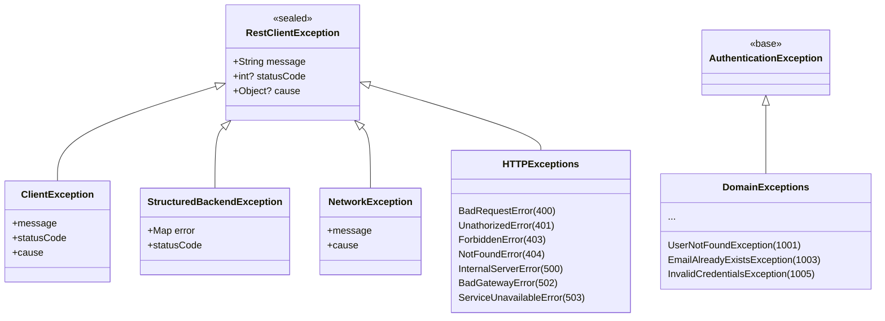

# REST Client Architecture

## Обзор

REST Client — это двухуровневая система HTTP-клиентов для работы с API:

- **Базовый клиент** (без интерцептора) — для запросов без авторизации (логин, регистрация)
- **Интерцептор клиент** (с интерцептором) — для авторизованных запросов (с Bearer токеном)



---

## 1. RestClientBase — базовый класс

### Основные методы

```dart
abstract base class RestClientBase implements RestClient {
  RestClientBase({required String baseUrl});

  // HTTP методы
  Future<Map<String, Object?>?> get(String path, {...});
  Future<Map<String, Object?>?> post(String path, {required Map body, ...});
  Future<Map<String, Object?>?> put(String path, {required Map body, ...});
  Future<Map<String, Object?>?> patch(String path, {required Map body, ...});
  Future<Map<String, Object?>?> delete(String path, {...});

  // Абстрактный метод для реализации
  Future<Map<String, Object?>?> send({...});
}
```

### Метод `handle()` — универсальная обработка запросов

**Назначение:** Централизованная обработка ошибок, уменьшение дублирования кода.

```dart
// В RestClientBase
Future<T> handle<T>({
  required Future<T> Function() processing,
  Future<Exception> Function(Object, StackTrace)? error,
}) async {
  try {
    return await processing();
  } on RestClientException {
    rethrow; // Уже наше исключение
  } on AuthenticationException {
    rethrow; // Исключение авторизации
  } on Object catch (err, stackTrace) {
    if (error != null) {
      throw await error.call(err, stackTrace);
    }
    throw ClientException(message: 'Response not understood');
  }
}
```

**Пример использования:**

```dart
final class ProductService {
  final RestClientBase _client;

  Future<Product> getProduct(int id) => _client.handle(
    processing: () async {
      final response = await _client.get('/products/$id');

      if (response case {'id': int id, 'name': String name}) {
        return Product(id: id, name: name);
      }

      throw FormatException('Invalid response format');
    },
  );
}
```

---

## 2. Два типа Data Sources

### ✅ С интерцептором (для авторизованных запросов)

**Когда использовать:** Все запросы, требующие Bearer токена.

**Паттерн:**

```dart
final class UserService with RestClientErrorHandlerMixin {
  UserService({required RestClientBase client}) : _client = client;

  final RestClientBase _client;

  Future<User> getProfile() => _client.handle(
    processing: () async {
      final response = await _client.get('/profile');

      if (response case {'id': int id, 'email': String email}) {
        return User(id: id, email: email);
      }

      handleErrorResponse(response); // ← Mixin
      throw FormatException('Invalid format');
    },
  );
}
```

### ❌ Без интерцептора (для авторизации)

**Когда использовать:** Логин, регистрация, сброс пароля (запросы БЕЗ Bearer токена).

**Паттерн:**

```dart
final class AuthDataSource with AuthErrorHandler {
  AuthDataSource({required Client client, required String baseUrl})
    : _client = client,
      _baseUrl = baseUrl;

  final Client _client;
  final String _baseUrl;

  Future<Token> login(String email, String password) async {
    final response = await _client.post(
      Uri.parse('$_baseUrl/auth/login'),
      body: jsonEncode({'email': email, 'password': password}),
      headers: {
        'Content-Type': 'application/json',
        'Accept': 'application/json',
      },
    );

    final body = jsonDecode(response.body);

    handleErrorResponse(body); // ← Mixin

    if (body case {
      'accessToken': String at,
      'refreshToken': String rt,
    }) {
      return Token(at, rt);
    }

    throw FormatException('Invalid response');
  }
}
```

---

## 3. Интерцепторы

### AuthInterceptor

**Назначение:** Автоматическое управление Bearer токеном, refresh при 401.



```dart
class AuthInterceptor extends SequentialHttpInterceptor with RetryRequestMixin {
  AuthInterceptor({
    required TokenStorage tokenStorage,
    required AuthorizationClient authClient,
    Client? retryClient,
  });

  @override
  Future<void> interceptRequest(BaseRequest request, RequestHandler handler) async {
    // 1. Загрузить токен
    var token = await _loadToken();
    if (token == null) {
      return handler.rejectRequest(RevokeTokenException('No token'));
    }

    // 2. Проверить валидность access token
    if (await _authClient.isAccessTokenValid(token)) {
      request.headers['Authorization'] = 'Bearer ${token.accessToken}';
      return handler.next(request);
    }

    // 3. Попытка refresh
    if (await _authClient.isRefreshTokenValid(token)) {
      try {
        token = await _authClient.refresh(token);
        await _tokenStorage.save(token);
        request.headers['Authorization'] = 'Bearer ${token.accessToken}';
        return handler.next(request);
      } on RevokeTokenException {
        await _tokenStorage.clear();
        rethrow;
      }
    }

    // 4. Токен невалиден
    await _tokenStorage.clear();
    return handler.rejectRequest(RevokeTokenException('Token expired'));
  }

  @override
  Future<void> interceptResponse(
    StreamedResponse response,
    ResponseHandler handler,
  ) async {
    // Обработка 401
    if (response.statusCode == 401) {
      var token = await _loadToken();
      if (token != null) {
        token = await _authClient.refresh(token);
        await _tokenStorage.save(token);

        // Повторный запрос с новым токеном
        final newResponse = await retryRequest(response);
        return handler.resolveResponse(newResponse);
      }
    }

    return handler.resolveResponse(response);
  }
}
```

---

## 4. Mixins для переиспользования кода

### RestClientErrorHandlerMixin

**Назначение:** Централизованная обработка структурированных ошибок от бэкенда.

```dart
mixin RestClientErrorHandlerMixin {
  void handleErrorResponse(Map<String, Object?>? body) {
    if (body case {
      'title': String message,
      'errorCode': int code,
    }) {
      throw _mapErrorCodeToException(code, message);
    }
  }

  Exception _mapErrorCodeToException(int code, String message) {
    return switch (code) {
      1001 => UserNotFoundException(),
      1003 => EmailAlreadyExistsException(),
      1005 => InvalidCredentialsException(),
      1010 => EmailNotConfirmedException(),
      _ => UnknownException(code: code, message: message),
    };
  }
}
```

**Таблица кодов ошибок:**

| Code | Exception                          | Описание                            |
| ---- | ---------------------------------- | ----------------------------------- |
| 1001 | UserNotFoundException              | Пользователь не найден              |
| 1002 | AccountAlreadyExistsException      | Аккаунт уже существует              |
| 1003 | EmailAlreadyExistsException        | Email уже занят                     |
| 1005 | InvalidCredentialsException        | Неверные учетные данные             |
| 1006 | EmailResendBlockedException        | Блокировка повторной отправки email |
| 1007 | VerificationTimeoutException       | Истекло время верификации           |
| 1008 | MaxVerificationAttemptsException   | Превышено количество попыток        |
| 1009 | IncorrectVerificationCodeException | Неверный код верификации            |
| 1010 | EmailNotConfirmedException         | Email не подтвержден                |

**Добавление нового errorCode:**

```dart
// В RestClientErrorHandlerMixin
Exception _mapErrorCodeToException(int code, String message) {
  return switch (code) {
    1001 => UserNotFoundException(),
    // ... существующие коды
    2001 => PaymentRequiredException(), // ← Новый код
    _ => UnknownException(code: code, message: message),
  };
}

// Создать исключение
final class PaymentRequiredException implements AuthenticationException {
  const PaymentRequiredException();
  static const int code = 2001;
}
```

### AuthErrorHandler

**Назначение:** Идентичен `RestClientErrorHandlerMixin`, но для auth-специфичных Data Sources.

**Когда использовать:**

- `RestClientErrorHandlerMixin` — для сервисов с `RestClientBase` (с интерцептором)
- `AuthErrorHandler` — для сервисов с `http.Client` (без интерцептора)

### RetryRequestMixin

**Назначение:** Клонирование и повторная отправка HTTP запроса.

```dart
mixin RetryRequestMixin {
  Future<StreamedResponse> retryRequest(
    StreamedResponse response, [
    Client? client,
  ]) async {
    final oldRequest = response.request;
    final newClient = client ?? Client();

    if (oldRequest is Request) {
      final newRequest = Request(oldRequest.method, oldRequest.url)
        ..headers.addAll(oldRequest.headers)
        ..bodyBytes = oldRequest.bodyBytes;

      return await newClient.send(newRequest);
    }

    if (oldRequest is MultipartRequest) {
      final newRequest = MultipartRequest(oldRequest.method, oldRequest.url)
        ..headers.addAll(oldRequest.headers)
        ..fields.addAll(oldRequest.fields)
        ..files.addAll(oldRequest.files);

      return await newClient.send(newRequest);
    }

    throw ArgumentError('Unknown request type');
  }
}
```

---

## 5. Обработка ошибок (3-уровневая система)



### Уровень 1: HTTP коды (обрабатывается в RestClientBase)

```dart
void handleErrorResponse(int statusCode) {
  Exception exception = switch (statusCode) {
    400 => BadRequestErrorRestException(message: 'Bad Request'),
    401 => UnathorizedErrorRestException(message: 'Unauthorized'),
    403 => ForbiddenErrorRestException(message: 'Forbidden'),
    404 => ResourseNotFoundErrorRestException(message: 'Not Found'),
    500 => InternalServerErrorRestException(message: 'Server Error'),
    502 => BadGatewayRestException(message: 'Bad Gateway'),
    503 => ServiceUnavailableRestException(message: 'Service Unavailable'),
    _ => ClientException(message: 'HTTP Error'),
  };
  throw exception;
}
```

### Уровень 2: Структурированные ошибки (StructuredBackendException)

```dart
// Response body:
{
  "errorCode": {
    "code": 123,
    "message": "Some error"
  }
}

// Автоматически преобразуется в:
throw StructuredBackendException(
  error: {'code': 123, 'message': 'Some error'},
  statusCode: 400,
);
```

### Уровень 3: Доменные ошибки (через Mixins)

```dart
// Response body:
{
  "title": "User not found",
  "errorCode": 1001
}

// handleErrorResponse() преобразует в:
throw UserNotFoundException();
```

---

## 6. Dependency Injection

### В composition_root.dart

```dart
Future<DependenciesContainer> createDependencies() async {
  // 1. Базовый HTTP клиент (platform-specific)
  final client = createDefaultHttpClient(); // Cronet/Cupertino

  // 2. TimezoneInterceptor (добавляет timezoneOffset)
  final timezoneClient = TimezoneInterceptor(inner: client);

  // 3. TokenStorage
  final tokenStorage = TokenStorageSP(sharedPreferences: prefs);
  final token = await tokenStorage.load();

  // 4. AuthInterceptor (управление Bearer токеном)
  final authInterceptor = AuthInterceptor(
    tokenStorage: tokenStorage,
    authorizationClient: JWTAuthorizationClient(timezoneClient),
    retryClient: client,
    token: token,
  );

  // 5. InterceptedClient (комбинация интерцепторов)
  final interceptedClient = InterceptedClient(
    inner: client,
    interceptors: [authInterceptor],
  );

  // 6. RestClientHttp с интерцептором (для авторизованных запросов)
  final restClient = RestClientHttp(
    baseUrl: config.baseUrl,
    client: interceptedClient,
  );

  // 7. Data Sources
  // БЕЗ интерцептора (для auth)
  final authDataSource = AuthDataSource(
    client: timezoneClient, // ← Только timezone, без auth
    baseUrl: config.baseUrl,
  );

  // С интерцептором (для остальных)
  final userService = UserService(client: restClient);
  final orderService = OrderService(client: restClient);

  return DependenciesContainer(
    authDataSource: authDataSource,
    userService: userService,
    orderService: orderService,
  );
}
```

---

## 7. Best Practices

### ✅ DO

```dart
// ✅ Использовать handle() для централизованной обработки
Future<Product> getProduct(int id) => _client.handle(
  processing: () async {
    final response = await _client.get('/products/$id');
    return Product.fromJson(response!);
  },
);

// ✅ Применять Mixins для обработки ошибок
final class ProductService with RestClientErrorHandlerMixin {
  Future<void> updateProduct(Product product) => _client.handle(
    processing: () async {
      final response = await _client.put('/products/${product.id}', body: {...});
      handleErrorResponse(response); // ← Централизованная обработка
    },
  );
}

// ✅ Использовать http.Client для запросов без токена
final class AuthService with AuthErrorHandler {
  final Client _client; // ← НЕ RestClientBase

  Future<Token> login(String email, String password) async {
    final response = await _client.post(...);
    final body = jsonDecode(response.body);
    handleErrorResponse(body);
    return Token.fromJson(body);
  }
}

// ✅ Проверять response на null (204 No Content)
Future<void> deleteProduct(int id) => _client.handle(
  processing: () async {
    final response = await _client.delete('/products/$id');
    if (response == null) return; // ← 204 успешно
    handleErrorResponse(response);
  },
);
```

### ❌ DON'T

```dart
// ❌ Не дублировать try-catch везде
Future<Product> getProduct(int id) async {
  try {
    final response = await _client.get('/products/$id');
    return Product.fromJson(response!);
  } on RestClientException {
    rethrow;
  } on Object {
    throw ClientException(message: 'Error');
  }
}
// Используйте _client.handle() вместо этого

// ❌ Не использовать RestClientBase с интерцептором для auth
final class AuthService {
  final RestClientBase _client; // ← WRONG! Будет добавлять Bearer токен

  Future<Token> login(...) async {
    // Запрос уйдет с Bearer токеном, которого еще нет!
  }
}

// ❌ Не игнорировать ошибки бэкенда
Future<void> updateProduct(Product product) async {
  final response = await _client.put('/products/${product.id}', body: {...});
  // Что если response содержит errorCode?
  return; // ← Ошибка не обработана
}
// Используйте handleErrorResponse(response)

// ❌ Не создавать множество http.Client
final class Service1 {
  final client = http.Client(); // ← BAD
}
final class Service2 {
  final client = http.Client(); // ← BAD
}
// Создавайте ОДИН client в composition_root и переиспользуйте
```

---
